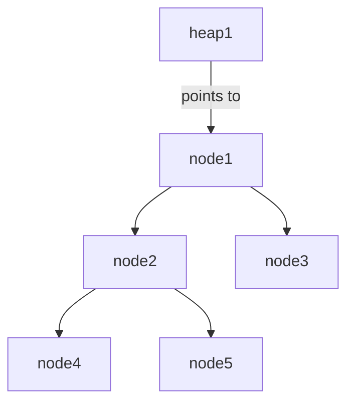
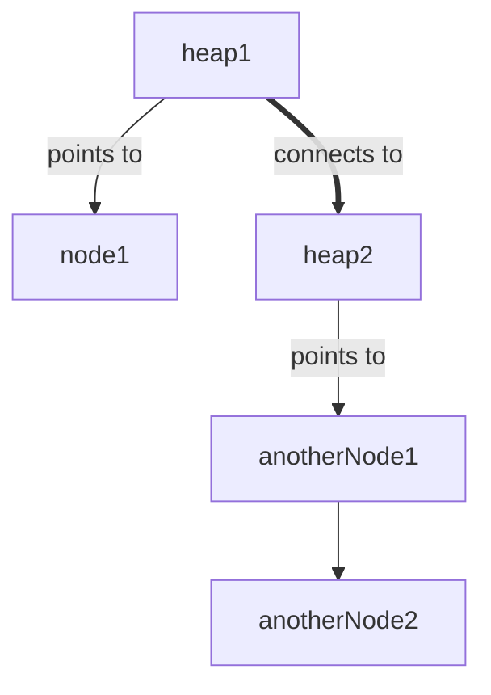
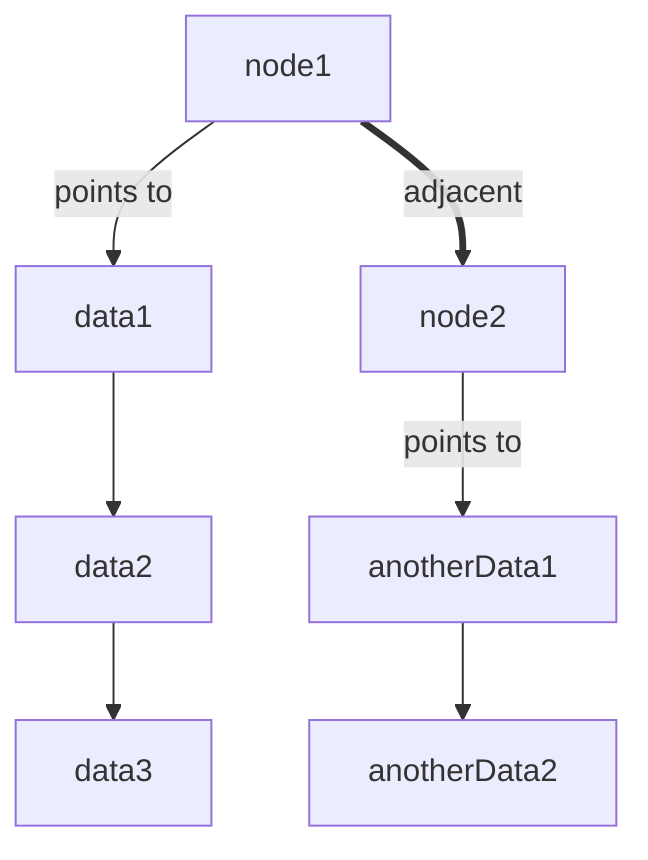
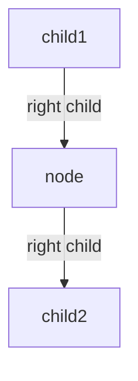
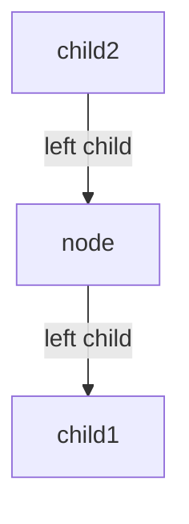

# Data Structures and Algorithms
## Heaps
Essentially, heaps are classified into two major categories: <b>Max heaps</b> and <b>min heaps</b>.
Min heaps means that <i>for each subtree, the root is always smaller than its children</i>;
Max heaps means that <i>for each subtree, the root is always greater than its children</i>.

### Insertion
Firstly, we directly push the element desired to be inserted into the heap. Afterwards, we reorganize the heap in such a manner that it matches the criteria of the current heap. How do we do that? Well, the element is simply bubbled up while it violates the criteria. It is always comparison with its parents, so no worries regarding further comparison.
### Typical structure
(Claim: just an instance, do NOT have to follow)

## DEAP
DEAPs support the retrieval of the maximum and the minimum elements. The structure of it is simple. Its root is an <b>empty node</b>. The left subtree is a min heap, while the right is a max heap.
The criteria for it is strict: <i>For each corresponding node, the left node must be less than the right node</i>.
### Insertion
For DEAPs, there are two things that <b>must</b> be taken into consideration:
<b>Firstly, its corresponding node.</b>
Since it satisfies the property of the complete binary tree, the number of min-heap nodes must be more than or equal to that of the max-heap, which means the nodes in max-heap always have their corresponding nodes. 
So, we insert the element, and find the current subtree location of it.
Left: If node > corresponding node, swap and rebuild right subtree. Otherwise, rebuild left subtree.
Right: If node < corresponding node, swap and rebuild left subtree. Otherwise, rebuild right subtree.
## Double-ended heap
Double-ended heap supports the same operations as DEAPs, just with a more abstract way. Also, the level alternates between min and max, gauranteed that an element on the min layer <b>must</b> be the minimum on the current subtree (the node and its child), and vice versa.
### Insertion
Insertion is simple:
Firstly, directly insert the element. 

The current layer of the element:
> Max, if element is divisible by 2 
> Min, otherwise 

If the element is on the max layer, its parent is on the min layer, so the element must be greater than its parent. If this is violated, swap with its parent and rebuild (max heap) on the element. Otherwise, it is correct, so rebuild (min heap) on the element. 

If the element is on the min layer, its parent is on the max layer, so the element must be less than its parent. If this is violated, swap with its parent and rebuild (min heap) on the element. Otherwise, it is correct, so rebuild (max heap) on the element.
:::info
:information_source: My comparison between both heaps and DEAPs
<table>
<tr>
<td>Using</td>
<td>106 (200000)</td>
<td>107 (300000)</td>
<td>108 (400000)</td>
</tr>
<tr>
<td>Heaps</td>
<td>3</td>
<td>4</td>
<td>6</td>
</tr>
<tr>
<td>DEAPs</td>
<td>2</td>
<td>4</td>
<td>6</td>
</tr>
</table>
<b>Disclaimer: This data is representative, but is definitely NOT standard. It could differ due to a lot of factors.</b>
:::
## Binomial heaps
### Definition
Binomial heaps have only <b>one possible form</b>. It is a collection of heaps placed in a linked list, and each node in it stores a heap. Each node is assigned an integer `k`, let amount of items in the heap be `l`, then `k` is `log2(l)`. Thus, each bit the binary representation of the items in a binomial heap represents whether or not that position has an element.
### Typical structure
(Claim: just an instance, do NOT have to follow)

### Merge operation
Merging is kind of simple:
Each element, if adjacent element has same `k` with the current element in the sorted, merged binomial heap, merges with the adjacent element to increase the merged element's `k` by 1.
## Fibonacci heaps
Same as binomial heaps, but do not have the restriction of length. Also, its merging is simply concatenating to fibonacci heaps. It has a minimum pointer, too.
## Multi-key node trees (e.g. 2-3 trees, etc)
These trees have nodes with different keys.
### Multi-key nodes definition
`n`-key, where `n > 1` has `n - 1` nodes and `n` childs
### Demonstration type
We are going to demonstrate 2-3 trees (tree with 2-nodes and 3-nodes)
## Insertion
To insert a node:<br>
Firstly, locate and add the new item into the leaf node.<br>
Then, sort the content of the leaf node.<br>
If the leaf node has overflowed (i.e. has three items):<br>
Split the leaf node.<br>
To split a node: <br>
Take the middle key of the current node and put it at the top of the node. <br>
Recursively do this if the top node has also overflowed.
### Typical structure
(Claim: just an instance, do NOT have to follow)

## AVL tree
Before in heaps, even though it is complete, it is not balanced. So is there a data structure that becomes balanced automatically after insertion? In fact, there is, and it is called AVL tree. (There is another one, called a red-black tree, which will be mentioned later).
### Structure
It is stored in a BST, but with different functionalities. 
### Rotation
#### Left rotation
A skewed tree like so:

should become a node whose child is `child1` and `child2` respectively.
Thus, a left rotation should be performed.
#### Right rotation
A right rotation is the opposite of left rotation, where 

will become the same tree as the right rotation's expected result.
Thus, a right rotation should be performed.
### Insertion steps
Let the newly inserted node be w,
1) Perform standard BST insert for w. 
2) Starting from w, travel up and find the first unbalanced node. Let z be the first unbalanced node, y be the child of z that comes on the path from w to z and w be the grandchild of z that comes on the path from w to z. 
3) Re-balance the tree by performing appropriate rotations on the subtree rooted with z. There can be 4 possible cases that needs to be handled as x, y and z can be arranged in 4 ways. Following are the possible 4 arrangements: 
a) y is left child of z and x is left child of y (Left Left Case) 
b) y is left child of z and x is right child of y (Left Right Case) 
c) y is right child of z and x is right child of y (Right Right Case) 
d) y is right child of z and x is left child of y (Right Left Case)
#### Left-left case
```
T1, T2, T3 and T4 are subtrees.
         z                                      y 
        / \                                   /   \
       y   T4      Right Rotate (z)          x      z
      / \          - - - - - - - - ->      /  \    /  \ 
     x   T3                               T1  T2  T3  T4
    / \
  T1   T2
  ```
#### Left-right case
```
     z                               z                           x
    / \                            /   \                        /  \ 
   y   T4  Left Rotate (y)        x    T4  Right Rotate(z)    y      z
  / \      - - - - - - - - ->    /  \      - - - - - - - ->  / \    / \
T1   x                          y    T3                    T1  T2 T3  T4
    / \                        / \
  T2   T3                    T1   T2
```
#### Right-right case
```
  z                                y
 /  \                            /   \ 
T1   y     Left Rotate(z)       z      x
    /  \   - - - - - - - ->    / \    / \
   T2   x                     T1  T2 T3  T4
       / \
     T3  T4
```
#### Right-left case
```
   z                            z                            x
  / \                          / \                          /  \ 
T1   y   Right Rotate (y)    T1   x      Left Rotate(z)   z      y
    / \  - - - - - - - - ->     /  \   - - - - - - - ->  / \    / \
   x   T4                      T2   y                  T1  T2  T3  T4
  / \                              /  \
T2   T3                           T3   T4
```
### Rough structure
Identical to BSTs.
## Red-black trees
Red-black trees are binary search trees, just with an additional attribute indicating colors. There are two possible colors: <span style="color: red">red</span> and black. The rules are as follows:
1. Root is BLACK.
2. There are NO two adjacent RED nodes.
3. Any path from root to its descendants have the same number of RED and BLACK nodes.

So, in insertion, we try to maintain the rules present above.
We can execute a color flip (i.e. <span style="color: red">red</span> to black, and vice versa), or execute a rotation in order to maintain its structure. Relatively, the amount of times to execute a rotation is smaller, so does the work required. However, its "neatness" is relatively unneater, since it might not remain that strictly balanced as opposed to AVLs. However, this is still quite great.
### Rough structure
The rough structure is similar to AVLs, but it has a color.
## Hash maps
Hash maps is a key-value related data structure. It is different as before. ADTs, as mentioned before, are split into 3 types:
 - Position-oriented ADTs
 - Value-oriented ADTs
 - Key-value oriented ADTs

However, hash maps are the fastest of all, with insertion, deletion, and retrieval ideally O(1)! It is composed of key-value pairs like so:
```json=
{
    key: "value"
}
```
### Hashing functions
Essentially, when placing elements in a hash map, you are executing a <b>hash function</b>. A hash function is a function that outputs a (likely) non-repetitive value that serves as indices in the table.
### Hashing collisions
Hashing functions returning the same result in different keys results in a hashing collision. Common ways of processing this involve inserting it into a linked list or ideally creating a better hashing function. Some functions are more ideal in certain situations.
#### Common hashing functions
 - Modulo hashing: `n % SIZE`, suitable when n is a prime number
 - Double hashing:`[hash1(n) + hash2(n) x SIZE] % SIZE`, suitable when `hash1` and `hash2` functions are valid

These avoid common hashing collisions. Reference [this link](https://www.geeksforgeeks.org/what-are-hash-functions-and-how-to-choose-a-good-hash-function/) for more hashing functions.
## Graphs
### Seven-bridges problem

Imagine you are a traveler :car:
Traveling in a country identical to the above.
:thinking_face: Can we somehow go through the above seven bridges in a single row?

:x: This try failed. The top right bridge cannot be crossed.
It turns out that every try will fail as long as the following condition is false:
> "The amount of islands that connect to even numbers of islands are 1 or 0."

In this case? Definitely false.

### Definition


Graphs are a set of nodes and edges. (Nodes are the dots, edges are the lines)
:::info 
:information_source: Trees are a type of graph, only that the edges cannot loop.
**Disclaimer: this will be mentioned later.**
:::
### Terminology
Node: a node is a point that can store data.
Edge: a connection between different nodes. It may contain weights on it.
Weights: a value on an edge. It can be distance, time, etc... Almost anything could work.
Directional graph: A graph in which an edge has a direction.
:white_circle: -> :white_circle: -> :white_circle:
Bidirectional graph: The opposite of directional graph.
ex:
:white_circle: - :white_circle: - :white_circle:
Acyclic graph: There are no loops.
:white_circle: - :white_circle: - :white_circle::x:
&nbsp;&nbsp;|____________|

### Storage
#### Adjacency Matrix

Here is an instance adjacency matrix:
|   | A | B | C |
| - | - | - | - |
| A | 1 | 0 | 1 |
| B | 0 | 1 | 0 |
| C | 1 | 0 | 1 |
For each `adjacencyMatrix[i][j]`, it conveys the concept that
```
In adjacencyMatrix: i -> j exists.
```
#### Adjacency list
1 -> 2
2 -> 3, 1
4 -> 
Represents:
1 -> 2 -> 3
|_____|
4
Therefore, each node is in the format:
`nodes[i] = the nodes that i connects to`
##### Special adjacency lists
Special adjacency lists?
It is an array.
Instead of storing the data (or the key), you simply store the index of the target element.
This is not only elegant but also more implementable.
### Graph traversals
#### DFS (search deep before wide, depth first search)
DFS searches depth first, as its name suggests.
&nbsp;&nbsp;&nbsp;:white_circle: - :white_circle: - ...
Lv. 1 &nbsp;&nbsp;&nbsp; 2 ...
So, we recurse through the nodes, looking at each level!
:white_circle:
:car:_
:white_circle:&nbsp;|
:car:_|
...
#### BFS (search wide before deep, breadth first search)
:white_circle:-:white_circle:-:white_circle:

Width is all the adjacent nodes. So, visit all the adjacent nodes, and go deep one level.
#### Considering implementation
Recursive: Simply recurse.
Iterative:
In DFS, use a stack to keep track of it (it is recursion!)
In BFS, use a queue to keep track of it.
### Topological sort
Imagine you have a video game that:
To get a :crossed_swords: you will need :moneybag: or :heart:
To save a :princess: you must have the :crossed_swords: and defeat the :dragon_face: 
This is a system of **dependencies**.
:moneybag: -> :crossed_swords: -> :dragon_face:  -> :princess:
:heart:_____|
What are the solutions to make you win (get the :princess:)?
You could get the following items in order:
:moneybag: :crossed_swords: :dragon_face: :princess:
or just use
:heart: :crossed_swords: :dragon_face: :princess:
Topological sort is an algorithm to output both!
So what does this have to do with graphs?
Directional graphs are a simple dependency system (If you didn't notice)
> :moneybag: -> :crossed_swords: -> :dragon_face:  -> :princess:
:heart:_____|

Remember this? This is a directional graph.
<style>
.ke {
    color: blue;
}
.se {
    color: purple;
}
.op {
    color: green;
}
</style>
#### Algorithm 1 (using removal, Kahn's algorithm)
<span class="ke">Repeat until</span> graph is empty:
<span class="ke">For each</span> node in graph:
<span class="ke">If</span> node <span class="ke">does not have</span> successors:
<span class="se">Output</span> node
<span class="op">Remove</span> node <span class="ke">from</span> graph
<span class="ke">End if</span>
<span class="ke">End for each</span>
<span class="ke">End repeat until</span>
#### Algorithm 2 (using DFS)
<span class="ke">Create</span> <span class="op">stack</span> stack
<span class="op">Push</span> the initial element <span class="ke">onto</span> the stack 
<span class="ke">While</span> stack <span class="op">unempty</span>: 
<span class="ke">If</span> unvisited vertex w <span class="op">adjacent to the top of</span> stack:
<span class="op">Push</span> w <span class="ke">into</span> stack
<span class="op">Mark</span> w as visited
<span class="ke">Else</span>
<span class="op">Pop</span> node from stack
<span class="se">Output</span> node
<span class="ke">End if</span>
<span class="ke">End for each</span>
## Minimum spanning tree (spanning tree)
### Introduction
:nerd_face: What defines an optimal network?
An optimal traversal algorithm speed is definitely required.
How do we implement this, or, specifically, what are the properties for a data structure that can store this information (considering that the only requirement is that each node has to be traversed, and having the minimum amount of edges)?
A minimum spanning tree, or the content we are going to introduce..
### Definition
The minimum spanning tree is defined as: the minimum subset of the graph so that a node can reach any other of the nodes. Also, the minimum spanning tree cannot contain cycles.
### Further discussion on properties
> The minimum spanning tree is defined as: the minimum subset of the graph so that a node can reach any other of the nodes.

→ The graph is an undirected connected graph.

> Also, the minimum spanning tree cannot contain cycles.

→ n nodes must have exactly n-1 edges in minimum spanning tree. More than that will generate a loop.

### Number of spanning trees in graph
```
o o-o              o-o-o
|/ \        vs.    |   |\
o   o-o            o   o o
```
The two graphs shown above are essentially isomorphic.
Isomorphic means that there is a bijection between the graphs' vertex sets.
#### Counting spanning trees
How do we calculate the amount of possible label permutations in a labeled tree? Well, the answer is as follows:
```
                                                         nodes - 1
 Permutations of arranging labels on a labeled tree are 2         .
```
### Tree to Prüfer sequence
A Prüfer sequence uniquely identifies a labeled tree of **consecutive numbers**, due to the fact that it traverses the labeled tree according to a given node's parent.
According to [Wikipedia](https://en.m.wikipedia.org/wiki/Pr%C3%BCfer_sequence):
> One can generate a labeled tree's Prüfer sequence by iteratively removing vertices from the tree until only two vertices remain. Specifically, consider a labeled tree _T_ with vertices {1, 2, ..., _n_}. At step _i_, remove the leaf with the smallest label and set the _i_ th element of the Prüfer sequence to be the label of this leaf's neighbour.

Instance:

First, we visit 1 because it is the smallest labeled leaf. Next, we take it's parent 4 and delete 1. The same case for 2 and 3. Currently, the traversal result is 4, 4, 4. Next we visit 4 which is the smallest-labeled leaf and take its parent, 5 and append it into the list, which generates 4, 4, 4, and 5.

:::warning
:warning: If labels are inconsecutive numbers, the tree cannot be identified purely via Prufer sequence!
:::
:::info
:information_source: Another (ideally sorted) label list is required for the tree to be converted truly, if the integers are inconsecutive.
:::
# External sort
Very very long ago, floppy disks were used.
